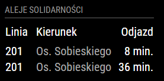

# MMM-pekavm
<B>Station monitor</B> for <B>Poznań public transport</B> bus and tram system.<P>

This module is an extension of the amazing [MagicMirror<sup>2</sup>](https://github.com/MichMich/MagicMirror) project by [MichMich](https://github.com/MichMich/). <P>

It is heavily based upon excellent [MMM-KVV](https://github.com/yo-less/MMM-KVV) module by [yo-less](https://github.com/yo-less/). Even this README is 80% coming from there.

## Screenshots



## Languages
The basis language is `Polish (pl)` but due to almost identical code to MMM-KVV language support for `German (de)` and `English (en)` locales was already possible.

## Prerequisite
A working installation of [MagicMirror<sup>2</sup>](https://github.com/MichMich/MagicMirror)

You need to add following line on top of `~/MagicMirror/js/app.js` and `~/MagicMirror/js/electron.js`:
```
process.binding('http_parser').HTTPParser = require('http-parser-js').HTTPParser;
```
This needed because PEKA server returns malformed responses that can't be handled by default node.js http parser.

## Dependencies
  * npm
  * [request](https://www.npmjs.com/package/request)
  * [http-parser-js](https://github.com/creationix/http-parser-js)

## Installation
1. Navigate into your MagicMirror's `modules` folder.
2. Execute `git clone https://github.com/ytmytm/MMM-pekavm.git`.
3. Execute `cd MMM-pekavm`.
3. Execute `npm install`.

## Module behavior
Please note that this module auto-creates a module header which displays the name of the chosen stop. It is therefore recommended not to add a 'header' entry to your config.js for this module.<P>
This module automatically disappears from your mirror as soon as a station has stopped offering connections at night. It reappears as soon as your chosen station is scheduled to be served again.<P>
This module has been programmed to allow for multiple instances. Simply add more MMM-pekavm config entries to your config.js file to display multiple stations and configure them according to your needs.

## Configuration
Sample minimum configuration entry for your `~/MagicMirror/config/config.js`:

```javascript
    {
	module: 'MMM-pekavm',
	position: 'top_left',
	config: {
		stopID: 'RKAP46',		// Which stop would you like to have displayed?
	}
    }						// If this isn't your last module, add a comma after the bracket
```

Sample configuration entry for your `~/MagicMirror/config/config.js` with optional parameters:

```javascript
    {
        module: 'MMM-pekavm',
        position: 'top_left',
        config: {
			stopID: 'RKAP46',	// Which stop would you like to have displayed?
			maxConn: 6,		// How many connections would you like to see?
			lines: ["1","5","238"],	// Which lines to show
			alwaysShowTime: true,	// Always show time of departure? (as HH:MM)
			showMessages: true,	// Show ZTM notifications about canceled lines, reroutes etc.?
			labelRow: true,		// Show or hide column headers
			reload: 60000		// How often should the information be updated? (In milliseconds)
	}
    }						// If this isn't your last module, add a comma after the bracket
```

## Figuring out the correct stopID
1. Open your web browser and navigate to [PEKA Wirtualny monitor](https://www.peka.poznan.pl/vm/).
2. Use the search field to find the stop you are interested in.
3. Once you can see the list of connections in your browser, click on the little text "Bezposredni link do przystanku" on the top right.
4. You will see something like `www.peka.poznan.pl/vm/?przystanek=RKAP71`
5. This string `RKAP71` is the `stopID` you are looking for.

Or you can just write down this symbol from the physical departures table on your stop.

Or you can search [ZTM website](http://ztm.poznan.pl/komunikacja/rozklad/) and check virtual image of a departures table with stop symbol [this link leads to RSTA41](http://ztm.poznan.pl/komunikacja/rozklad/#/rozklad/wgLinii/ZTM_MPK/0/233/1).

## Config Options
| **Option** | **Default** | **Description** |
| :---: | :---: | --- |
| stopID | RKAP46 | <BR>Which stop would you like to have displayed? <BR><EM> Default: Rondo Kaponiera (level 0 tram stop)</EM><P> |
| maxConn<BR>`optional` | 8 | <BR> How many connections would you like to see?<P> |
| lines<BR>`optional` | [] | <BR> Which lines would you like to see? <BR><EM> Default: all</EM><P> |
| alwaysShowTime<BR>`optional`| true | <BR>Show time of departure also as wall clock time (HH:MM)<BR> <EM>Possible values: true, false</EM><P> |
| showMessages<BR>`optional` | true | <BR>Show special ZTM notifications about canceled and rerouted lines, etc.<BR> <EM>Possible values: true, false</EM><P> |
| labelRow<BR>`optional` | true | <BR> Show or hide column headers<BR> <EM>Possible values: true, false</EM><P> |
| reload<BR>`optional`  | 30000 | <BR> How often should the information be updated? (In milliseconds) <BR><EM> Default: Every half minute </EM><P> |

## Licence
MIT License

Copyright (c) 2017 Maciej Witkowiak (https://github.com/ytmytm/)

Permission is hereby granted, free of charge, to any person obtaining a copy
of this software and associated documentation files (the "Software"), to deal
in the Software without restriction, including without limitation the rights
to use, copy, modify, merge, publish, distribute, sublicense, and/or sell
copies of the Software, and to permit persons to whom the Software is
furnished to do so, subject to the following conditions:

The above copyright notice and this permission notice shall be included in all
copies or substantial portions of the Software.

THE SOFTWARE IS PROVIDED "AS IS", WITHOUT WARRANTY OF ANY KIND, EXPRESS OR
IMPLIED, INCLUDING BUT NOT LIMITED TO THE WARRANTIES OF MERCHANTABILITY,
FITNESS FOR A PARTICULAR PURPOSE AND NONINFRINGEMENT. IN NO EVENT SHALL THE
AUTHORS OR COPYRIGHT HOLDERS BE LIABLE FOR ANY CLAIM, DAMAGES OR OTHER
LIABILITY, WHETHER IN AN ACTION OF CONTRACT, TORT OR OTHERWISE, ARISING FROM,
OUT OF OR IN CONNECTION WITH THE SOFTWARE OR THE USE OR OTHER DEALINGS IN THE
SOFTWARE.
